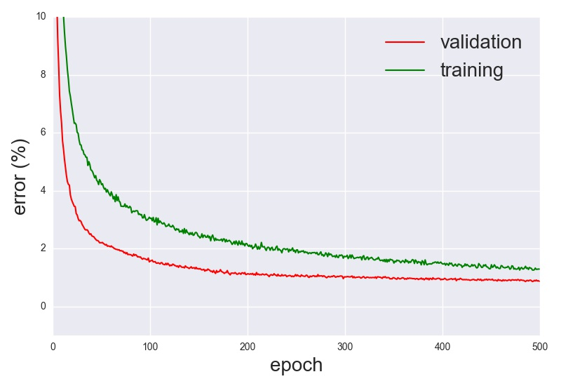
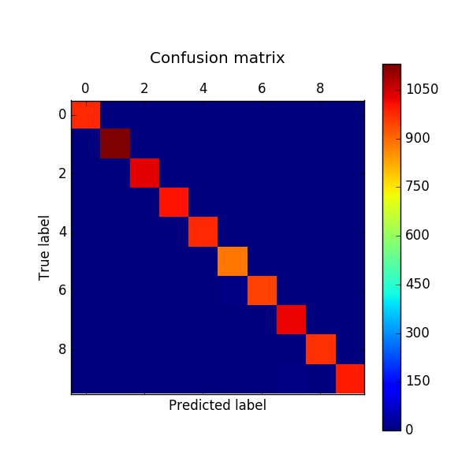

# deep-learning-mnist

### Description:

MNIST Digit classification using Python (Lasagne + Theano library). 

Training takes about 20 minutes with GPU; thanks [National Supercomputing Centre (NSCC) Singapore](http://www.nscc.sg)!  

The main implementation is in ```mnist_model.py``` which uses helper functions from ```__helpers__.py```. For plotting validation/training errors and confusion matrix see ```plot_error.py``` and ```plot_cm.py``` respectively. All the output, training information, weights and plots are saved/pickled in the 'output' folder.

Run/theano settings: ```THEANO_FLAGS='mode=FAST_RUN, device=gpu, floatX=float32' python mnist_model.py```

### Results:

* 98.71% accuracy on training data
* 99.13% accuracy on validation data
* 99.36% accuracy on test data.

### Validation/Training Error:



### Confusion Matrix:



### References:

[1] Dataset: <http://deeplearning.net/data/mnist/>

[2] Lasagne documentation: <http://lasagne.readthedocs.io/>

[3] Lasagne examples: <https://github.com/Lasagne/Recipes>

[4] Theano documentation: <http://deeplearning.net/software/theano/>